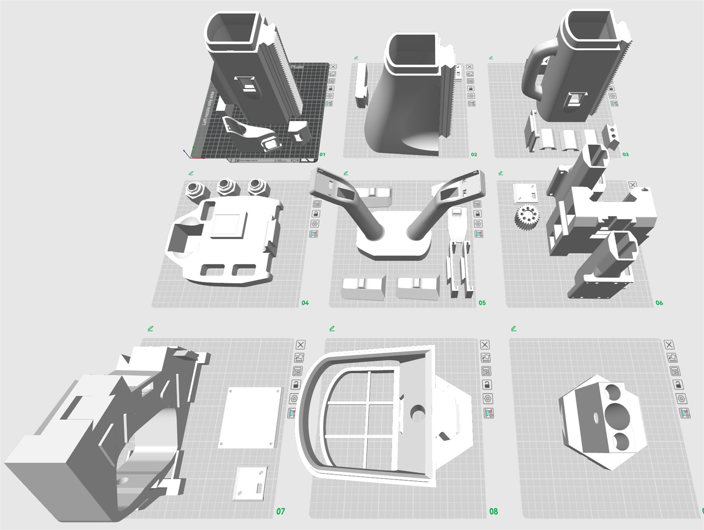

# AlohaMini2 Print Guide

AlohaMini2 structural parts can be printed with PLA, PETG, ABS, or similar FDM materials. The parts are designed for a Bambu P2S-class printer.

## Recommended Settings

| Setting | Recommendation |
|---|---|
| Wall loops | 4-6 |
| Infill | 15-25% |
| Support | Enable where required by the slicer |

For the best strength, use **6 wall loops** on load-bearing parts.

## Printed Parts

Print the STL files from:

```text
AlohaMini2/hardware/mobile_base2/stl/
```

Unless listed otherwise, each STL file is printed once.

| STL file | Qty | Notes |
|---|---:|---|
| `O_Chassis_Dowel_Pin_12_80.stl` | 3 | Printed substitute for chassis steel pins |
| `O_Main_Assembly_Post4.stl` | 1 |  |
| `O_POST4_Connector_Base.stl` | 1 |  |
| `O_T_Connector_Cross_Bar.stl` | 1 | Printed substitute for the aluminum T-frame |
| `O_T_Connector_Dowel_Pin_12_25.stl` | 1 | Printed substitute for the lift-axis steel pin |
| `OB_Buck_Converter_Mount.stl` | 1 |  |
| `OB_Chassis_Bearing_Cover.stl` | 3 |  |
| `OB_Chassis_Frame_Joiner.stl` | 3 |  |
| `OB_Chassis_Locking_Wedge.stl` | 3 |  |
| `OB_Chassis_Segment_1of3_PrintOptimized.stl` | 3 | Recommended chassis segment |
| `OB_Chassis_Wheel_Axle_Connector.stl` | 3 |  |
| `OB_Main_Assembly_Post1.stl` | 1 |  |
| `OB_Main_Assembly_Post2.stl` | 1 |  |
| `OB_Main_Assembly_Post3.stl` | 1 |  |
| `OB_Main_Monitor_Connector.stl` | 1 |  |
| `OB_POST4_Mount_Adapter.stl` | 1 |  |
| `OB_POST4_RPi_Mount.stl` | 1 |  |
| `OB_T_Camera_Mount.stl` | 1 |  |
| `OB_T_Connector_Left.stl` | 1 |  |
| `OB_T_Connector_Middle.stl` | 1 |  |
| `OB_T_Connector_Right.stl` | 1 |  |
| `OB_Top_Camera_Back_Cover.stl` | 2 |  |
| `OB_Top_Camera_Mount.stl` | 1 |  |
| `OB_Z_Axis_Servo_Gear.stl` | 1 |  |

## Material Notes

| Material | Notes |
|---|---|
| PLA | Easiest to print, but lower strength and heat resistance. Good for general test builds. |
| PETG | Tougher than PLA, but stringier and more prone to rack/gear tooth adhesion. Use PLA or dedicated support material for support interfaces when possible. |
| ABS | Stronger and more heat-resistant, but more likely to warp. Use an enclosed printer, such as X2D, and control chamber temperature. |

## Chassis Printing

The chassis segments are large and can warp during printing. For the chassis, use the print-optimized STL when available:

```text
OB_Chassis_Segment_1of3_PrintOptimized.stl
```

## Printed Substitutes

If the BOM-listed aluminum extrusion for the T-frame or the chassis steel pins are not available, printed substitutes can be used. However, printed substitutes will significantly reduce structural strength. Use metal parts for the final build whenever possible.

## Bambu Studio Plate Layout

Use this Bambu Studio Prepare view as the print plate layout reference:


